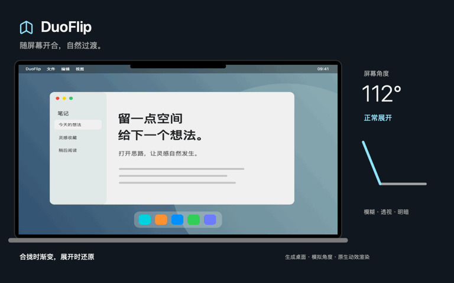

# DuoFlip


随 MacBook 屏幕开合变化的桌面过渡效果。DuoFlip 读取翻盖角度，用当前桌面的内存快照呈现连续模糊、透视和明暗变化，并常驻 macOS 菜单栏。

当前版本：**0.7.0 预览版**。原生 Swift / AppKit / SwiftUI / ScreenCaptureKit / Core Image / Metal，无第三方运行时依赖。

## 动效演示

[](https://github.com/AresNing/DuoFlip/raw/refs/heads/main/docs/assets/duoflip-demo.mp4)

合拢时逐渐模糊、收拢透视并变暗，展开时恢复清晰。右侧示意屏幕角度变化。

[观看或下载高清视频 · 12 秒](https://github.com/AresNing/DuoFlip/raw/refs/heads/main/docs/assets/duoflip-demo.mp4)

演示使用应用现有的原生渲染代码、生成的示例桌面和模拟角度，不是真机录屏。没有采集私人桌面，也不包含原始参考视频。

## 使用

1. 打开 DuoFlip，左键单击菜单栏图标展开设置浮层。
2. 开启「开合效果」。默认自动选择内置屏幕，首次需在 macOS「隐私与安全性 → 录屏与系统录音」允许 DuoFlip；按系统要求重启或重新确认权限。
3. 屏幕正常展开至 95° 以上，再缓缓合盖即可触发。设置中可调节效果强度。
4. 按 **Esc** 或关闭效果开关，立即停止采集并释放画面；应用继续常驻。浮层内「退出 DuoFlip」结束应用。

关闭「自动选择内置屏幕」可改用系统的单次选屏授权。系统共享指示保持可见；自动模式不等于绕过授权，也不会在启动应用时自动启用效果。

「会议软件运行时关闭效果」默认开启，可分别选择飞书 / Lark、腾讯会议、Zoom 和 Microsoft Teams。**所选软件只要运行就会触发避让，即使没有开会。** 这是提前避让规则，不是其他应用屏幕共享状态的精确检测；浏览器会议不在识别范围内。可取消勾选常驻软件或关闭该规则。自身采集被系统中断、报错或持续无响应时仍会关闭效果，且不会自动抢占重试或恢复。

## 环境与限制

- Apple Silicon MacBook，macOS 15.2 或更高版本，以及可读取翻盖角度的硬件。
- 实机验证设备为 MacBook Pro M3 Pro；不保证所有 MacBook 型号支持传感器读取。
- 只作用于内置屏幕。使用覆盖层显示效果，不接管系统锁屏，不保证唤醒第一帧衔接。
- 效果开启期间全局 Esc 用于关闭效果；关闭后释放。若 Esc 注册失败，效果不会启动。
- 多 Spaces、全屏应用、不同会议软件和长期功耗仍需要更多实机验证。
- 当前默认构建使用 ad-hoc 签名，未完成 Developer ID 签名和 Apple 公证。其他 Mac 可能被 Gatekeeper 阻止打开。

## 从源码构建

需要 macOS，以及提供 macOS 15.2+ SDK 的 Xcode 或 Command Line Tools。生产输出固定为 arm64。

```sh
git clone https://github.com/AresNing/DuoFlip.git
cd DuoFlip
./scripts/build.sh
open .build/DuoFlip.app
```

源码使用 `swiftc` 和系统框架直接构建；当前没有 Xcode 工程或 Swift Package。构建入口是仓库内的脚本，无需原型目录、参考素材或额外下载依赖。

```sh
./scripts/test.sh           # 动画、触发状态及会议避让逻辑检查
./scripts/test.sh --native  # 另运行需要图形会话和 Metal 的首帧显示检查
./scripts/package.sh        # 重新构建，生成 DMG、ZIP 和 SHA256
```

安装包输出到 `dist/`，重复打包相同版本会拒绝覆盖。应用版本由 `Packaging/Info.plist` 管理；更新版本时同步更新使用说明和变更记录。构建与测试不会自动授权录屏，也不会开启桌面采集。

正式签名、公证和验证边界见 [开发说明](docs/development.md)。仓库 CI 运行逻辑检查与应用构建，不代表真实传感器或屏幕授权已验收。

## 项目结构

```text
Sources/DuoFlip/   菜单栏应用、设置、传感器、采集与动画
Tests/            逻辑检查及原生首帧检查
scripts/          构建、测试、打包入口
Packaging/        应用元数据与随包使用说明
Brand/            品牌图标生成器
docs/             开发说明和自有品牌素材
ThirdParty/       第三方许可
.github/workflows/ GitHub 构建检查
```

旧原型、安装包历史、私人参考视频、桌面画面和本机验证记录不属于源码仓库。

## 隐私

桌面画面仅在本机内存中处理，不保存截图或录像，不上传，不采集音频或麦克风。效果关闭时停止采集、清除内存帧并停止角度采样。正常运行不写诊断日志；开发者可显式开启仅含角度、帧数、尺寸和状态的本地诊断。

本实现需要读取屏幕像素来处理真实桌面内容；录屏权限仍由 macOS 管理。参见 [Apple ScreenCaptureKit 示例](https://developer.apple.com/documentation/screencapturekit/capturing-screen-content-in-macos)。

## 来源与许可

翻盖传感器协议参考 [Sam Gold 的 LidAngleSensor](https://github.com/samhenrigold/LidAngleSensor)。完整说明见 [第三方声明](THIRD_PARTY_NOTICES.md)。DuoFlip 是独立应用，不代表 Apple 官方产品或背书。

DuoFlip 自有代码和品牌素材目前尚未指定开源许可证；公开可见不等于授予通用的使用、修改或再分发许可。第三方内容遵循其各自许可证。
