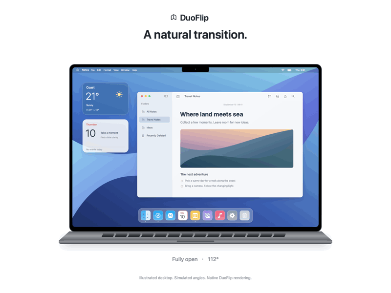

# DuoFlip

**English** | [简体中文](README.zh-CN.md)


Desktop transitions that respond to your MacBook's lid angle. DuoFlip uses an in-memory snapshot of the current desktop to create smooth changes in blur, perspective, and brightness. It lives in the macOS menu bar.

Current version: **0.8.0 preview**. Built with native Swift, AppKit, SwiftUI, ScreenCaptureKit, Core Image, and Metal. No third-party runtime dependencies.

The app supports English and Simplified Chinese, following your system’s preferred languages by default. Choose **Language → System / English / 简体中文** in the menu bar popover to switch instantly. Other unsupported system languages fall back to English.

## Demo

[](https://github.com/AresNing/DuoFlip/raw/refs/heads/main/docs/assets/duoflip-demo.en.mp4)

As the lid closes, the desktop gradually blurs, narrows in perspective, and dims. Reopening restores clarity. The illustration preserves the MacBook Pro display proportions, with the simulated lid angle shown below.

[Watch or download the high-resolution video · 12 seconds](https://github.com/AresNing/DuoFlip/raw/refs/heads/main/docs/assets/duoflip-demo.en.mp4)

This demo uses the app's native rendering code, generated desktop artwork, and simulated angles. It is not a recording of a physical device. It contains no private desktop capture or original reference footage.

## Usage

Download the **0.8.0 preview** from [GitHub Releases](https://github.com/AresNing/DuoFlip/releases):

- [DMG installer · Apple Silicon](https://github.com/AresNing/DuoFlip/releases/download/v0.8.0/DuoFlip-0.8.0-arm64.dmg)
- [ZIP archive](https://github.com/AresNing/DuoFlip/releases/download/v0.8.0/DuoFlip-0.8.0-arm64.zip) · [SHA256 checksums](https://github.com/AresNing/DuoFlip/releases/download/v0.8.0/DuoFlip-0.8.0-SHA256.txt)

Open the DMG, drag `DuoFlip.app` to Applications, and launch it from there. Alternatively, extract the ZIP and copy the app. Preview packages are ad-hoc signed and not notarized by Apple; Gatekeeper may block them on other Macs. Requires macOS 15.2+ and an Apple Silicon MacBook with a readable lid-angle sensor.

1. Open DuoFlip and left-click its menu bar icon to expand the settings popover.
2. Turn on **Lid effect**. Automatic selection of the built-in display is enabled by default. On first use, allow DuoFlip under macOS **Privacy & Security → Screen & System Audio Recording**. Restart the app or reconfirm access if macOS requests it.
3. Open the lid to at least 5° above the trigger angle (95° with the default), then gently close it. Settings offer effect strength and a trigger angle of 75°–125° in 1° steps, defaulting to 90°. Higher angles start the effect earlier; changes are saved and require opening the lid to the new ready angle before the next transition.
4. Press **Esc** or turn off the effect to stop capture and release the desktop image immediately. DuoFlip stays in the menu bar. Choose **Quit DuoFlip** in the popover to exit the app.

Turn off **Select built-in display automatically** to use the system's screen picker for each capture session. The system sharing indicator remains visible. Automatic selection does not bypass permission checks or enable the effect when the app launches.

**Stop for meeting apps** is enabled by default. You can select Feishu / Lark, Tencent Meeting, Zoom, and Microsoft Teams individually. **A selected app triggers this rule whenever it is running, even if no meeting is active.** This is a conservative precaution, not precise detection of another app's screen-sharing state. Browser-based meetings are not detected. Deselect apps you keep running, or turn off the rule. DuoFlip still disables the effect if its own capture is interrupted, fails, or remains unresponsive; it does not automatically retry or resume.

## Requirements and limitations

- An Apple Silicon MacBook running macOS 15.2 or later, with hardware that exposes a readable lid-angle sensor.
- Physical-device testing has been performed on a MacBook Pro with M3 Pro. Sensor access is not guaranteed on every MacBook model.
- The effect applies only to the built-in display. It uses an overlay, does not control the system lock screen, and cannot guarantee a transition on the first frame after wake.
- Esc is reserved as a global stop key while the effect is enabled and released when it is disabled. If registering Esc fails, the effect will not start.
- Multiple Spaces, full-screen apps, different meeting applications, and long-term power consumption need further testing on physical devices.
- Default builds are ad-hoc signed and do not have Developer ID signing or Apple notarization. Gatekeeper may prevent them from opening on other Macs.

## Build from source

You need macOS and Xcode or Command Line Tools with the macOS 15.2 SDK or later. Production builds target arm64.

```sh
git clone https://github.com/AresNing/DuoFlip.git
cd DuoFlip
./scripts/build.sh
open .build/DuoFlip.app
```

The project builds directly with `swiftc` and system frameworks. It currently has no Xcode project or Swift package. The scripts in this repository are the build entry points; no prototype directory, reference media, or additional dependency downloads are required.

```sh
./scripts/test.sh           # Animation, state, meeting-app, and localization checks
./scripts/test.sh --native  # Also check first-frame presentation; requires a GUI session and Metal
./scripts/package.sh        # Rebuild and generate DMG, ZIP, and SHA256 files
```

Packages are written to `dist/`. Packaging the same version again refuses to overwrite existing output. The app version is managed in `Packaging/Info.plist`; update the bundled usage instructions and changelog when changing it. Building and testing do not grant screen-recording access or start desktop capture.

See the [development guide (Chinese)](docs/development.md) for signing, notarization, and validation details. Repository CI runs logic checks and builds the app; it does not validate real sensor access or screen-recording permissions.

## Repository structure

```text
Sources/DuoFlip/   Menu bar app, settings, sensor access, capture, and effects
Resources/        English and Simplified Chinese localization catalogs
Tests/            Logic checks and native first-frame presentation checks
scripts/          Build, test, packaging, and demo generation scripts
Packaging/        App metadata and bundled usage instructions
Brand/            Brand icon generator
docs/             Development guide and original brand/demo assets
ThirdParty/       Third-party licenses
.github/workflows/ GitHub build checks
```

Earlier prototypes, historical installation packages, private reference videos, captured desktop images, and local validation records are not part of this source repository.

## Privacy

Desktop images are processed only in local memory. DuoFlip does not save screenshots or videos, upload images, or capture system audio or microphone input. Disabling the effect stops capture, clears the in-memory frames, and stops angle sampling. Normal operation does not write diagnostic logs. Developers can explicitly enable local diagnostics containing only angles, frame counts, dimensions, and status.

This implementation needs screen pixels to transform the actual desktop. Screen-recording permission remains under macOS control. See [Apple's ScreenCaptureKit sample](https://developer.apple.com/documentation/screencapturekit/capturing-screen-content-in-macos).

## Credits and licensing

The lid-angle sensor protocol references [Sam Gold's LidAngleSensor](https://github.com/samhenrigold/LidAngleSensor). See the [third-party notices](THIRD_PARTY_NOTICES.md) for details. DuoFlip is an independent app, not an official Apple product or an Apple-endorsed implementation.

DuoFlip's own code and brand assets do not currently have an open-source license. Public visibility does not grant a general license to use, modify, or redistribute them. Third-party material remains subject to its respective license.
